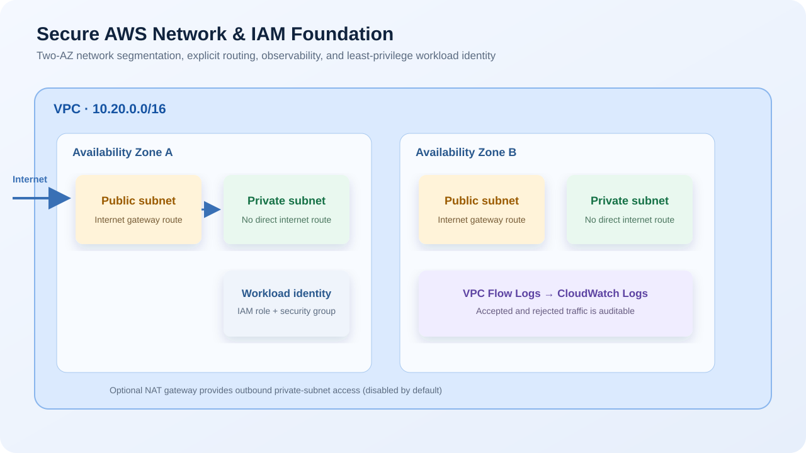

# Secure AWS Network and IAM Foundation with Terraform

Project 02 in the Terraform AWS learning series. This repository creates the
production-style network and identity baseline that later application projects
reuse: a two-Availability-Zone VPC, public and private subnets, explicit
routing, flow logs, a restricted workload security group, and workload IAM.

## Architecture



## Repository structure

```text
.
├── providers.tf              # AWS provider and AZ discovery
├── locals.tf                 # Naming, subnet calculations, shared tags
├── network.tf                # VPC, subnets, routes, IGW, optional NAT
├── security.tf               # Workload security group
├── iam.tf                    # Flow-log and workload roles/policies
├── observability.tf          # CloudWatch log group and VPC Flow Logs
├── variables.tf              # Deployment inputs
├── outputs.tf                # IDs and ARNs for later projects
├── terraform.tfvars.example  # Safe deployment values
└── diagrams/architecture.svg # README infrastructure infographic
```

## What is created

- One VPC with DNS support enabled
- Two public and two private subnets across available AZs
- An internet gateway, public route table, and route associations
- A private route table with no direct internet route
- Optional single NAT gateway and Elastic IP for private outbound access
- A workload security group: no ingress and HTTPS-only egress
- VPC Flow Logs sent to CloudWatch Logs with 30-day retention
- A least-privilege workload IAM role and instance profile for future EC2 use

## Prerequisites

- Terraform 1.6+
- AWS CLI authenticated to the intended AWS account
- IAM permissions for VPC, EC2 networking, IAM, CloudWatch Logs, and VPC Flow
  Logs resources

Check the target account before deployment:

```bash
aws sts get-caller-identity
```

## Deploy

```bash
git clone https://github.com/siddhantbhattarai/terraform-aws-network-iam-foundation.git
cd terraform-aws-network-iam-foundation
cp terraform.tfvars.example terraform.tfvars
terraform init
terraform fmt -check
terraform validate
terraform plan
terraform apply
```

Choose your own `project_name`, `environment`, and non-overlapping `vpc_cidr`
in `terraform.tfvars` before applying.

## Verification

Use Terraform outputs:

```bash
terraform output
```

In the AWS Console verify:

1. **VPC → Your VPCs**: the VPC CIDR matches your variables file.
2. **VPC → Subnets**: two public and two private subnets exist in two AZs.
3. **VPC → Route tables**: only the public table has a direct route to the
   internet gateway; private routing uses NAT only if enabled.
4. **EC2 → Security Groups**: the workload group has no inbound rules and only
   TCP/443 outbound access.
5. **CloudWatch → Log groups**: the VPC flow-log group exists.
6. **IAM → Roles**: the workload role trusts EC2 and has only log-writing
   permissions.

## Security and cost

- Private subnets are not directly routable from the internet.
- The workload security group intentionally starts with no inbound access.
- Flow logs make accepted and rejected network traffic auditable.
- `enable_nat_gateway` defaults to `false` to avoid NAT gateway hourly and data
  processing costs. Set it to `true` only when private workloads need outbound
  internet access.
- A single NAT gateway is an affordable learning configuration; production
  high availability normally uses one NAT gateway per AZ.

## Clean up

```bash
terraform destroy
```

Confirm the AWS account and region before approving destruction. Terraform
removes only the resources tracked in this project's state.

## Next project

Continue with [Encrypted Configuration Store](https://github.com/siddhantbhattarai/terraform-aws-encrypted-configuration-store): KMS, Systems Manager Parameter Store, Secrets Manager, and IAM policies.
